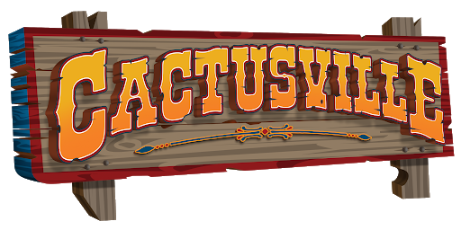

# CVML_HW

## Welcome to Cactusville!
Cactusville is a small town populated by - you guessed correcty - cacti. Since it is a rapidly developing village, they are considering to use self-driving vehicles in their hometown. Your job as a computer vision maestro is to develop the required detection methods.

### The setting
Cactusville is quite unique in the sense that the entire surface of the town is covered in blue tablecloth. The exact colour and pattern of the cloth may vary slightly.

By-and large there are 3 different objects of interest:

- Cacti: These are the inhabitants of the village, so self-driving cars must be able to detect them to avoid hitting a cactus. Cacti have four basic sub-types: Happy, Sad, Angry and Evil
- Vehicles: These are other vechiles you should also avoid colliding with. There are 3 vehicles in Cactusville: An SUV, a truck, and an airplane.
- Traffic Signs: There are several signs placed all around the town, often multiple ones on a single stand. There are 55 different traffic sign classes, which are not listed here for the sake of brevity.

### Tasks
The people of Cactusville provided 4 videos for you to develop your algorithms with. Each video consists of several RGB and corresponding depth frames, which are found in the 'rgb' and 'depth' subfolders of the video. They are ordered numerically. The depth image is a single-channel, 16-bit image, where the pixel value is the distance of that pixel from the camera in mm.

The videos also contain a calibration.yaml file, which contains the intrinsic parameters of the camera. These are the same for all videos used, so feel free to hardcode the important values into your program.

Your team has to complete the following tasks:

- Traditional Vision: Create an algorithm to accurately detect and classify the 3 objects of interest (Cactus, Vehicle, Traffic Sign). You don't have to determine the subclass at this point.
- Deep Learning: Use a deep learning algorithm to classify traffic signs. The package provided includes a training and validation database of 32x32 RGB images.
- 3D Vision: Determine the 3D positions of the object of interest relative to the camera. Use the center of an object's bounding box to determine the position on the image.

### Hardcore Tasks
There are also 3 hardcore tasks for those who like challenges. These aren't particularly difficult, but they take more work and require you to go a little bit beyond the scope of the practicals.

- Traditional Vision: Determine the subclasses of Cacti and Vehicles
- Deep Learning: Of the 55 possible traffic signs, 3 are missing from the training and test datasets. ('X - Priority', 'X - Turn left', 'X - Turn right') As a result, the neural net trained in task 2 will not be able to classify them properly. Extend your neural network to classify these as well.
- 3D Vision: Determine the absolute pose (4x4 transformation matrix) of the camera as it moves throughout the video. You can safely assume that the pose in the first frame of every video is the identity matrix.

### Evaluation and Score
The basic package also contains annotations (correct answers) in the file annotations.pickle and a small python script evaluate.py you can use to measure the performance of your algorithm.

Your homework score will be computed using the same script, albeit on 2 secret videos that you were not provided. The reason for this is to make sure that your algorithm works in new situations as well. The secret videos use the same 2 tablecloths and 3 vehicles, but the traffic signs and the cacti may be different. Not to mention the illumination.

The tasks will be evaluated using the following metrics:

- Task 1 - Average Precision (AP): This metric is simply the average of Recall (nCorrect / nObject) and Precision (nCorrect / nPrediction).
- Tasks 1 HC, 2 and 2 HC - Classification accuracy
- Tasks 3 and 3 HC - RBF error: This is simple the squared error between the prediction and the correct answer transformed by an RBF (Radial Basis Function) kernel. This means that a perfect answer has a score of 1, a bad answer will result in a score close to 0.
